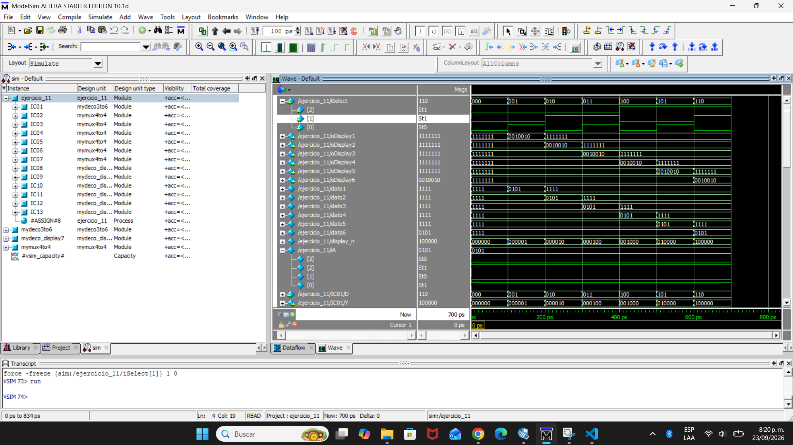
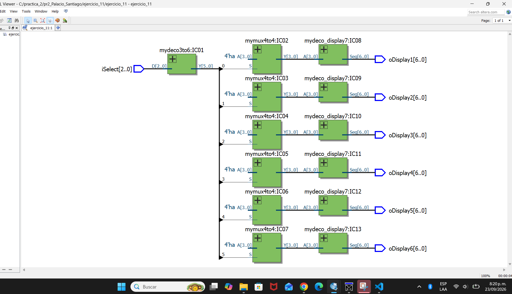
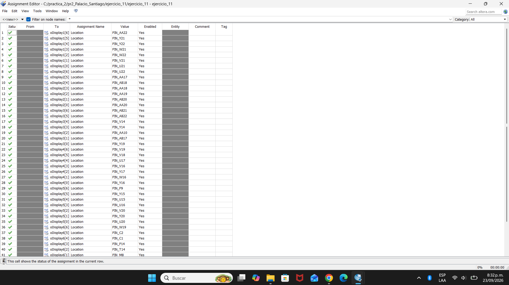
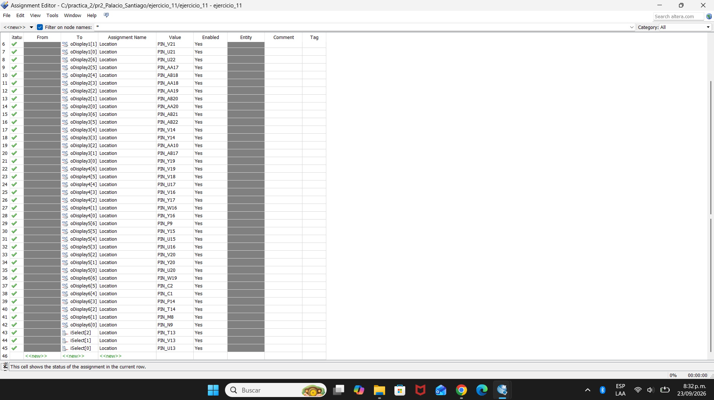

EL EJERCICIO 1 ESTÁ EN LA CARPETA DEL EJERCICIO 2 Y VICEVERSA

### Ejercicio 11

  

  

  

  

  <a href="https://youtu.be/-EZwkxlv73s" style="text-decoration: none; font-weight: bold; color: #0969da; font-family: sans-serif;">🔊 Ver en YouTube</a>

|||