# Práctica 1 Electrónica Digital

## Santiago Palacio Vargas
## Compuertas Lógicas

EL EJERCICIO 1 ESTÁ EN LA CARPETA DEL EJERCICIO 2 Y VICEVERSA

## Los ejercicios del 1 al 10  fueron sustentados en clase

### Ejercicio 11

  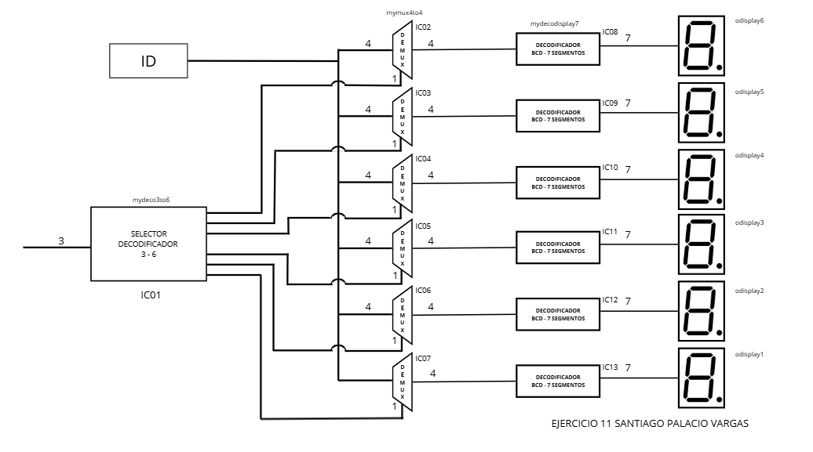

  

  

  

  

  <a href="https://youtu.be/VO2rgi5AAsw" style="text-decoration: none; font-weight: bold; color: #0969da; font-family: sans-serif;">🔊 Ver en YouTube</a>

|||

### Ejercicio 12

  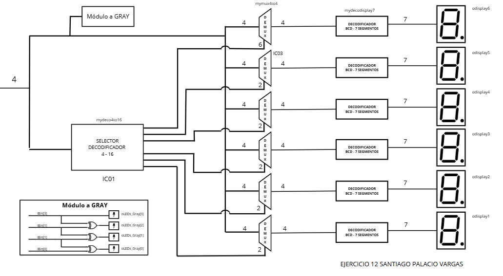

  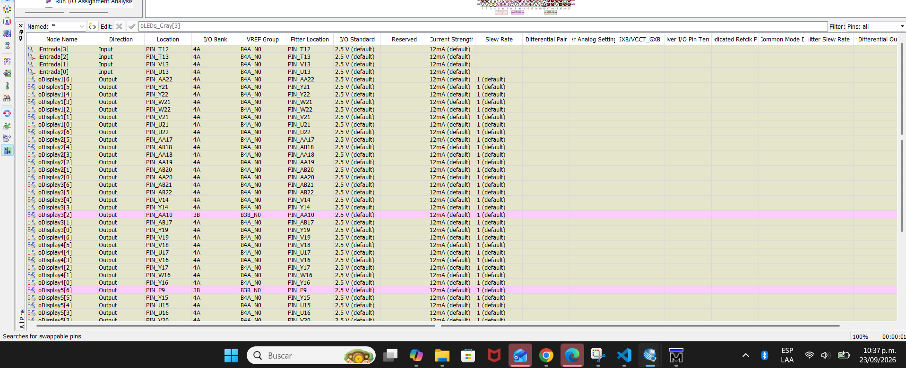

  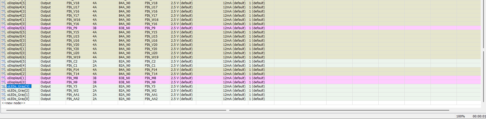

  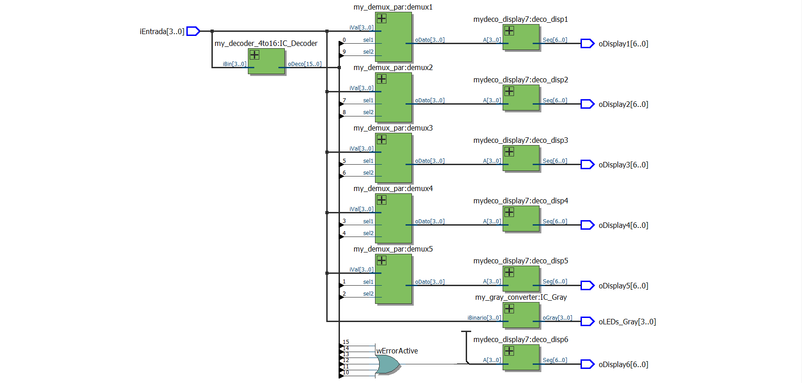

  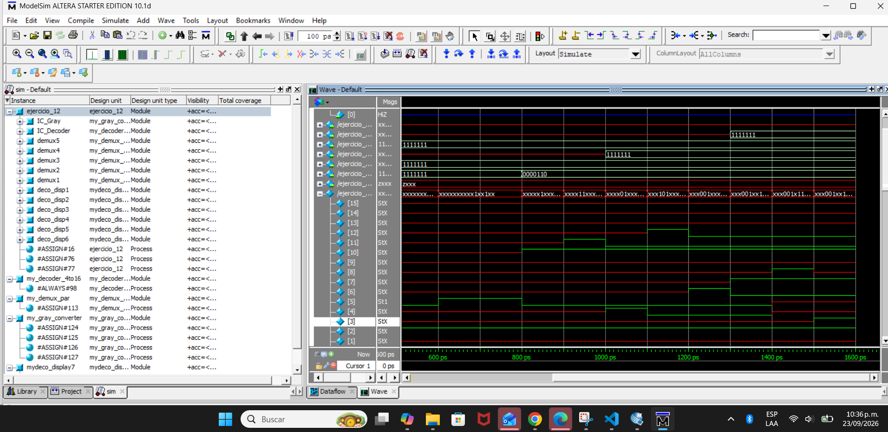

  <a href="https://youtu.be/vlYr3cCrjJY" style="text-decoration: none; font-weight: bold; color: #0969da; font-family: sans-serif;">🔊 Ver en YouTube</a>

|||

### Ejercicio 13

  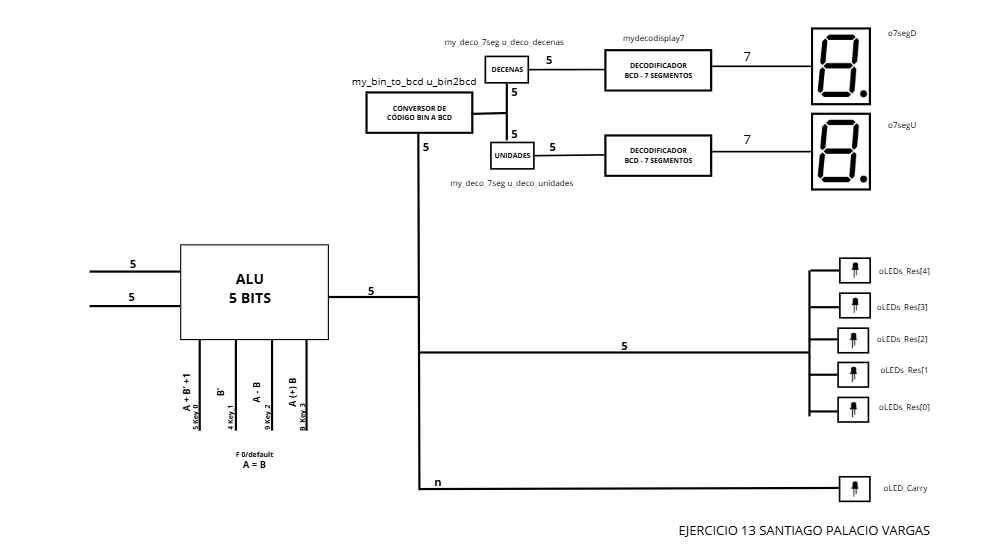

  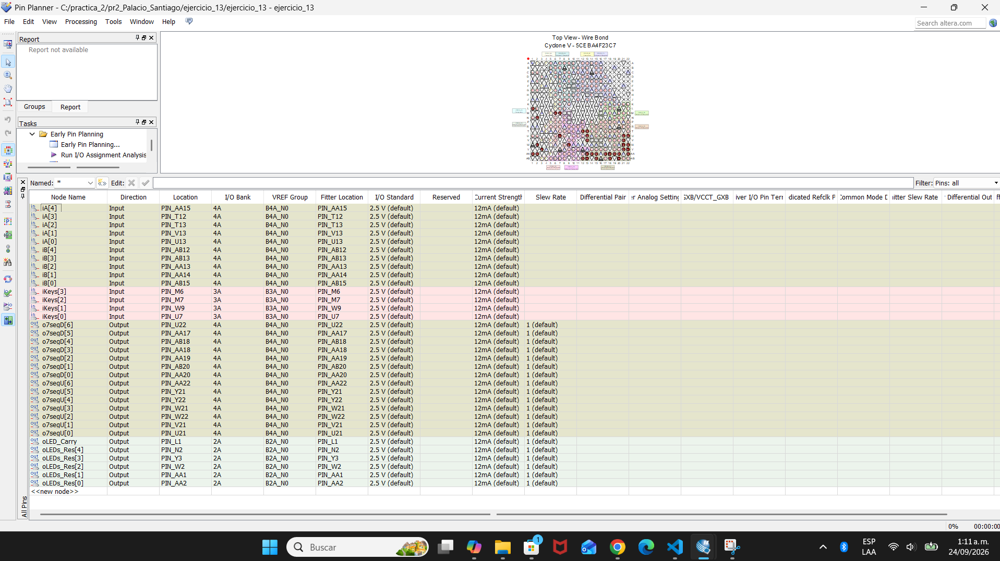

  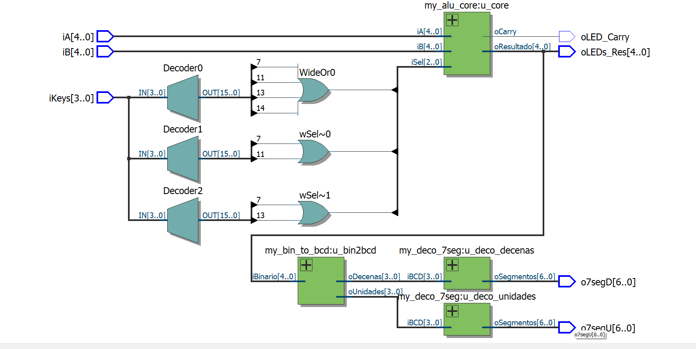

  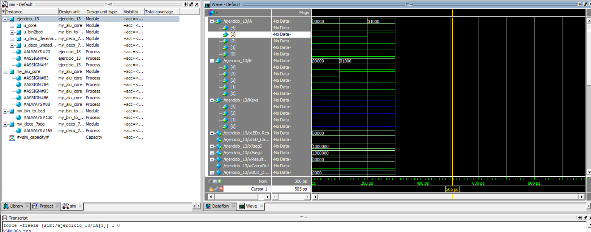

  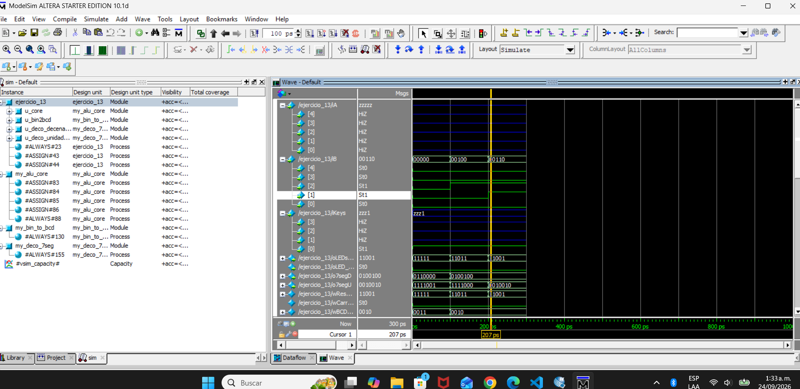

  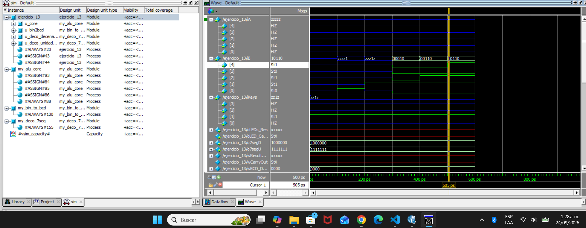

  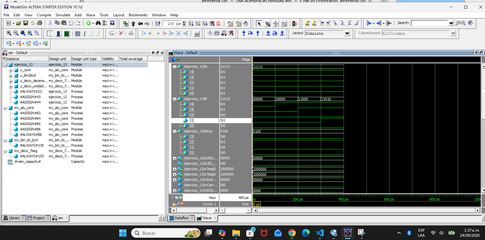

  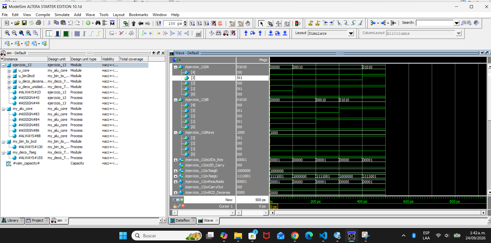

orex invertido

  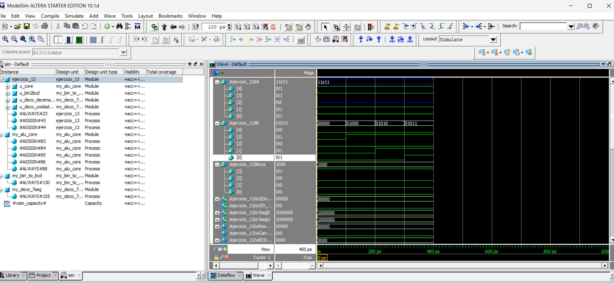

 orex normal

  <a href="https://youtu.be/thZ9IyJJpBM" style="text-decoration: none; font-weight: bold; color: #0969da; font-family: sans-serif;">🔊 Ver en YouTube</a>

|||